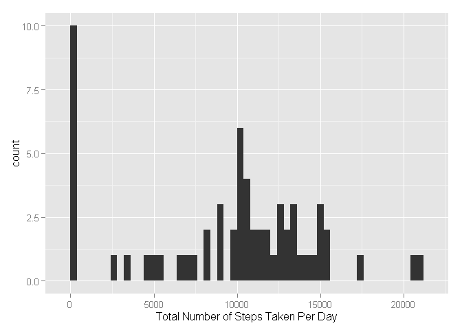

# Reproducible Research: Peer Assessment 1


## Loading and preprocessing the data

```r
setwd('Y:\\coursera\\reproducible research\\RepData_PeerAssessment1')
data <- read.csv("activity.csv")
```


## What is mean total number of steps taken per day?


```r
# Code below calculates total number of steps per day
library(dplyr)
```

```
## 
## Attaching package: 'dplyr'
## 
## The following object is masked from 'package:stats':
## 
##     filter
## 
## The following objects are masked from 'package:base':
## 
##     intersect, setdiff, setequal, union
```

```r
total_steps_perday <- data %>% group_by(date) %>%
    summarise(dailySum = sum(steps,na.rm=T))
head(total_steps_perday)
```

```
## Source: local data frame [6 x 2]
## 
##         date dailySum
## 1 2012-10-01        0
## 2 2012-10-02      126
## 3 2012-10-03    11352
## 4 2012-10-04    12116
## 5 2012-10-05    13294
## 6 2012-10-06    15420
```


```r
# Code below makes histogram of total number of steps per day
library(ggplot2)
p <- ggplot(total_steps_perday,aes(dailySum))+
    geom_histogram(binwidth=400)+
    xlab('Total Number of Steps Taken Per Day')
p
```

 


```r
# Code below calculates and reports the mean and median of the total number of steps taken per day
# mean is 9354.23
mean(total_steps_perday$dailySum)
```

```
## [1] 9354.23
```

```r
#median is 10395
median(total_steps_perday$dailySum)
```

```
## [1] 10395
```
## What is the average daily activity pattern?

```r
# Code below calculates average steps taken per interal across all days
daily_activity <- data %>% group_by(interval) %>%
    summarise(intervalMean = mean(steps,na.rm=T))
head(daily_activity)
```

```
## Source: local data frame [6 x 2]
## 
##   interval intervalMean
## 1        0    1.7169811
## 2        5    0.3396226
## 3       10    0.1320755
## 4       15    0.1509434
## 5       20    0.0754717
## 6       25    2.0943396
```


```r
# Code below makes time series plot of average steps taken per interal across all days
q <- ggplot(daily_activity,aes(interval,intervalMean))+
    geom_line(size=1.2)+
    xlab('5-min Interval')+
    ylab('Average Steps Taken per 5-min Interal Across All Days')
q
```

 

```r
# Code below makes ranks average steps taken per interal across all days
arrange(daily_activity,desc(intervalMean))
```

```
## Source: local data frame [288 x 2]
## 
##    interval intervalMean
## 1       835     206.1698
## 2       840     195.9245
## 3       850     183.3962
## 4       845     179.5660
## 5       830     177.3019
## 6       820     171.1509
## 7       855     167.0189
## 8       815     157.5283
## 9       825     155.3962
## 10      900     143.4528
## ..      ...          ...
```

```r
#Interval 835 has the most steps
```

## Imputing missing values

```r
# Code below calculates and reports the total number of missing values in the dataset
sum(is.na(data$steps))
```

```
## [1] 2304
```

```r
#2304 rows have missing data
```


```r
# Code below fills missing values with interval average and creates a new dataset that is equal to the original dataset but with the missing data filled in.
data_fillna <- inner_join(data,daily_activity,by='interval')
data_fillna$steps[is.na(data_fillna$steps)] <- data_fillna$intervalMean[is.na(data_fillna$steps)]
data_fillna <- select(data_fillna,-4)
```


```r
# Code below calculates total number of steps per day
total_steps_perday1 <- data_fillna %>% group_by(date) %>%
    summarise(dailySum = sum(steps,na.rm=T))
head(total_steps_perday1)
```

```
## Source: local data frame [6 x 2]
## 
##         date dailySum
## 1 2012-10-01 10766.19
## 2 2012-10-02   126.00
## 3 2012-10-03 11352.00
## 4 2012-10-04 12116.00
## 5 2012-10-05 13294.00
## 6 2012-10-06 15420.00
```


```r
# Code below makes histogram of total number of steps per day
ggplot(total_steps_perday1,aes(dailySum))+
    geom_histogram(binwidth=400)+
    xlab('Total Number of Steps Taken Per Day')
```

 

```r
# Code below calculates and reports the mean and median of the total number of steps taken per day
# mean is 10766.19
mean(total_steps_perday1$dailySum)
```

```
## [1] 10766.19
```

```r
#median is 10766.19
median(total_steps_perday1$dailySum)
```

```
## [1] 10766.19
```

```r
# These number are different from just ignoring missing values. 
# The esmitates of total daily number of steps increased from 9354.23 to 10766.19.
```
## Are there differences in activity patterns between weekdays and weekends?

```r
# Code below creates a new factor variable "weekday" in the dataset with two levels - "weekday" and "weekend"
data_fillna$date <- as.Date(data_fillna$date)
data_fillna$weekdays <- weekdays(data_fillna$date)
data_fillna$weekday <- ifelse(data_fillna$weekdays %in% c('Saturday','Sunday'),'weekend','weekday')
```


```r
# Code below makes time series plot of average steps taken per interal across all days by "weekday" and "weekend"
daily_activity1 <- data_fillna %>% group_by(weekday,interval) %>%
    summarise(intervalMean = mean(steps))
              
ggplot(daily_activity1,aes(interval,intervalMean))+
    geom_line(size=1.2)+
    facet_wrap(~ weekday, ncol = 1)+
    xlab('5-min Interval')+
    ylab('Average Steps Taken per 5-min Interal Across All Days')
```

 

```r
# It looks like weekend activity is more uniform during the date time. However, on weekdays, activities are mostly in lunch break hours
```
